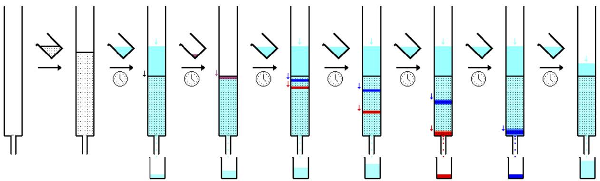

# Устройства автоматизации колоночной хроматографии
В настоящее время, хроматографический метод разделения веществ широко применим во многих научных лабораториях по всему миру. Одним из наиболее популярных видов является препаративная колоночная хроматография, активно использующаяся исследователями в области органической химии по сей день.

Интерес к данному методу выделения индивидуальных соединений из смеси не случаен – для его проведения нужны крайне дешевые расходные материалы (чаще всего силикагель или цеолит в качестве неподвижной фазы и этилацетат, гексан в качестве элюента) и недорогое стеклянное оборудование (колонка, пробирки или плоскодонные колбы). Более того, в результате прохождения смеси через колонку на выходе научный сотрудник получает продукт с чистотой до 99%.
Подбирая колонку нужного диаметра и регулируя толщину слоя твёрдого адсорбента, исследователь имеет возможность разделять смеси самой различной массы, что является важным преимуществом перед дорогостоящим оборудованием высокоэффективной жидкостной хроматографией (ВЭЖХ), в котором имеются ограничения по массе вводимого вещества. 
Однако существенным недостатком метода препаративной колоночной хроматографии является его длительное время проведение и непосредственное участие исследователя для замены заполненной колбы на пустую под колонкой. В зависимости от диаметра колонки и адсорбента каждая колба наполняется элюентом в среднем за 4-5 минуты, после чего её нужно менять вручную на новую. Так, научный сотрудник вынужден, откладывая проведение синтезов, следить за хроматографическим процессом.
Решением проблемы долгой ручной сортировки может стать устройство, которое умеет вовремя сменять колбы по мере их наполнения и желательно разделять по стекаемо фазе. Так как в лабораториях часто используют конические колбы объёмом 25 мл и 50 мл, то прибор должен уметь работать с ними.
Существующие решения весьма дорогие, потому исследовательские команды часто не могут позволить себе профессиональные ВЭЖХ или сортировщики фракций, моя задача - найти компромисс между качаством разделяемых смесей, удобством и разумной ценой.