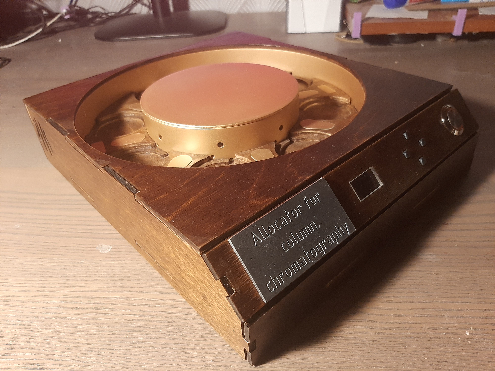

# Прототип A1-4CCH
**Allocator for Column Chromatography v1**

## Назначение
Разработка устройства для автоматической смены колб под хроматографической колонкой по мере их наполнения.
## Статус
Завершён. Испытания проведены.
## Конструкция
* Карусельный механизм для размещения приёмных колб.
* Привод карусели — шаговый двигатель.
* Система управления построена на платформе Arduino.
* Определение наполненности колб лазером и фоторезистором.

## Средства разработки
### CAD
* Autodesk Inventor Professional 2024

### Прошивка
* Arduino IDE

## Результаты
* Разработано и изготовлено работоспособное устройство.
* Работоспособность подтверждена лабораторными испытаниями.
* Продемонстрирована возможность автоматической смены колб по мере их наполнения без участия оператора.
* Получен патент на метод определения наполненности колб.

## Выявленные недостатки
### Конструкция
* Карусельный механизм имеет большие габариты при сравнительно небольшой вместимости.
* Масса и размеры конструкции плохо масштабируются при увеличении количества колб.

### Материалы
* Использование фанеры для изготовления крупных деталей позволило снизить стоимость и ускорить изготовление прототипа, однако оказалось неудачным решением.
* Коробление фанеры приводило к перекосу барабана и ухудшению плавности его вращения.

### Эксплуатационные испытания
* Во время лабораторных испытаний отдельные колбы были пропущены вследствие заедания барабана.
* Основными причинами являлись недостаточная плавность вращения механизма и геометрические отклонения деталей.

## Основные выводы
Прототип подтвердил работоспособность выбранной концепции автоматической смены колб. Вместе с тем испытания показали, что карусельная архитектура обладает ограниченной масштабируемостью, а применение фанеры для силовых элементов конструкции отрицательно влияет на надёжность механизма. Необходимо выбрать более надёжную конструкцию.

