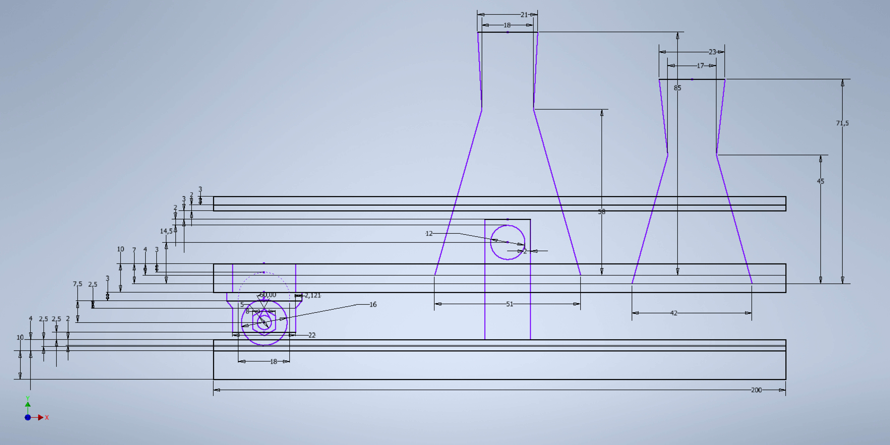

Толщина нижней основы 10 мм
Толщина верхней основы 4 мм
Углубление для колёс в верхней фанере 2 мм слишком глубокое углубление потребует уменьшение зазора между коробом и основой, уменьшение углубления может сказаться на схождении колёс с углубления
Углубление для вставки стенки 2.5 мм для большей устойчивости
Расстояние от датчика холла до магнита 5 мм, растояние получено приблизительно экспериментально
Расстояние от низа короба до верхней основы 2.5 мм, при такой конфигурации растояние от края окружности до края короба равняется 1 мм
Расстояние от центра окружности до перегородки обусловлено использованием фаски протянувшейся на 2.5 мм по вертикали
Толщина перегородки 3 мм для обеспечения прочности
Лазер расположен на рассоянии 13,5 мм над дном маленькой колбы так как при достижении лазера колба будет заполнена на 15мл а большая будет заполнена на 20мл. С учётом толщины дна колбы расстояние от нижнего держателя до лазера равна 14.5 мм