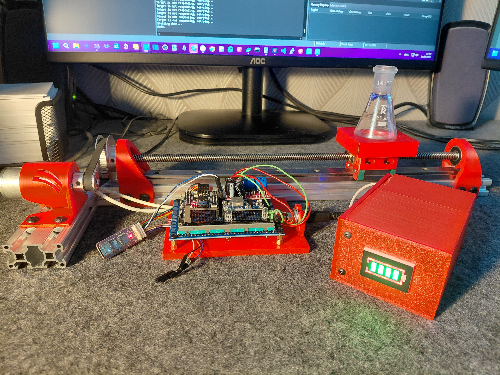

# Эксперимент A2-4CCH
**Pivot axis**

## Назначение
Тестирование передвижения каретки с колбой по оси
## Статус
Завершён. Испытания проведены.
## Конструкция
* Трапецеидальный винт с гайкой Tr8x8.
* Привод - JGA25-370 DC gear motor.
* Управление на плате STM32G474CEU6 от WeAct.
* Управление скоростью и направлением линейным потенциометром.

## Средства разработки
### CAD
* Компас-3D v24

### Прошивка
* CubeIDE 1.18.1

## Результаты
* Реализовано перемещение вдоль оси

## Выявленные недостатки
### Конструкция
* Ременная передача занимает много места.
* Из-за неосведомлённости о необходимости шлифовать ось, посадка подшипника была произведена лишь частично.
* Вместо угловых сухарей стоило использовать blind joint.

### Материалы
* Использование экструзионных профилей сильно облегчило разбработку конструкции

### Эксплуатационные испытания
* Из-за недостатков драйвера наблюдался прерывистый ход на первом канале при движении в одну из сторон, второй канал дал плавность в обе стороны, но был несколько разбалансирован
* Контакт потенциометра отходил при неосторожном передвижении движка, что также сказывалось на плавности хода

## Основные выводы
Необходимо заменить драйвер, шлифовать оси и использовать крепление blind joint.

